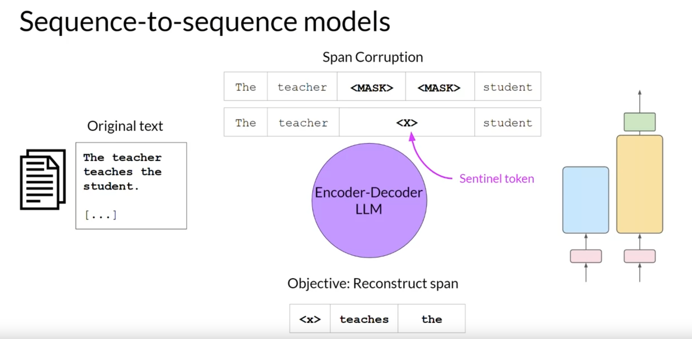

# Week 1 - Part 1: Intro to LLMs and the GenAI Project Life Cycle

## Transformer Architecture

### Overview

- **Context**: Transformer architecture improved natural language task performance, surpassing RNNs.
- **Key Feature**: Ability to learn relevance and context of words in a sentence, using attention mechanisms.

### Key Elements of Transformer Architecture

1. **Self-Attention Mechanism**
    - **Function**: Determines the relevance of each word to others in the sentence.
    - **Example**: Words like "book" strongly connect with "teacher" and "student".
    - **Impact**: Enhances the model's language encoding capabilities.
2. **Architecture Components**
    - **Structure**: Divided into encoder and decoder.
    - **Flow**: Inputs at the bottom, outputs at the top.
    - **Reference**: Derived from the "Attention is All You Need" paper.
3. **Tokenization and Embedding**
    - **Tokenization**: Converts words into numbers (token IDs).
    - **Embedding Layer**: Maps token IDs to multi-dimensional vectors, encoding meaning and context.
    - **Vector Size**: In the original transformer paper, it was 512.
4. **Positional Encoding**
    - **Purpose**: Maintains word order information.
    - **Integration**: Added to token vectors at the base of the encoder/decoder.
5. **Self-Attention Layer**
    - **Role**: Analyzes relationships between input tokens.
    - **Output**: Reflects the importance of each word to all others in the sequence.
6. **Multi-Headed Self-Attention**
    - **Concept**: Multiple sets of self-attention weights learned independently.
    - **Variability**: 12-100 attention heads are common, each learning different language aspects.
    - **Learning**: Heads are randomly initialized and learn aspects of language over time.
7. **Feed-Forward Network and Output Processing**
    - **Process**: Input data processed through a fully-connected network.
    - **Output**: Vector of logits proportional to the probability score for each token.
    - **Final Step**: Logits normalized into a probability score for each word.

### Important Concepts

- **Attention Map**: Visualizes attention weights between words.
- **Input Processing**: Involves tokenizing words, embedding them into vectors, and adding positional encoding.
- **Training and Learning**: Self-attention weights are learned during training.

### Significance

- The Transformer architecture significantly improves model's ability to understand and generate language by capturing complex contextual relationships among words in a sentence.

## Attention is all you need

### Key Contributions of "Attention is All You Need" Paper

1. **Introduction of the Transformer Model**:
    - **Core Idea**: The paper proposed the Transformer model, which relies entirely on attention mechanisms to draw global dependencies between input and output, without using sequence-aligned RNNs or convolution.
2. **Self-Attention Mechanism**:
    - **Definition**: The ability of the model to attend to different positions of the input sequence to compute a representation of the sequence.
    - **Efficiency**: It allows for more parallelization and lessens the path length between long-range dependencies in the data, compared to RNNs or CNNs.
3. **Scaled Dot-Product Attention**:
    - **Formula**: Attention(Q, K, V) = softmax(QK^T / √dk)V.
    - **Components**:
        - Queries (Q), Keys (K), Values (V) from the input.
        - The output is a weighted sum of the values, where the weight assigned to each value is computed by a compatibility function of the query with the corresponding key.
        - Scaling factor (√dk) used to avoid large dot products growing and pushing the softmax function into regions where gradients are extremely small.
4. **Multi-Head Attention**:
    - **Purpose**: The model uses multiple heads in the attention mechanism to allow the model to jointly attend to information from different representation subspaces at different positions.
    - **Implementation**: Parallel attention layers (heads) are used, each producing its own output before being concatenated and linearly transformed into the desired dimension.
5. **Model Architecture**:
    - **Encoder and Decoder Stacks**: The model has encoder and decoder stacks. Each stack has six layers.
    - **Layer Composition**: Each layer in both encoder and decoder contains a multi-head self-attention mechanism and a simple, position-wise fully connected feed-forward network.
    - **Decoder Modification**: The decoder has an additional sub-layer, which performs multi-head attention over the output of the encoder stack.
6. **Positional Encoding**:
    - **Necessity**: Since the model doesn’t use recurrence or convolution, positional encodings are added to give the model information about the relative or absolute position of the tokens in the sequence.
    - **Implementation**: The paper uses sine and cosine functions of different frequencies.
7. **Training and Regularization**:
    - **Data and Training**: The model was trained on standard datasets like WMT 2014 English-to-German and English-to-French translation tasks.
    - **Regularization Techniques**: The Transformer model also uses residual connections and layer normalization to facilitate training and prevent overfitting.
8. **Performance**:
    - **Benchmarking**: The Transformer model achieved state-of-the-art performance on the translation tasks it was tested on.
    - **Efficiency**: The model was found to be more parallelizable and requiring significantly less time to train.

### Significance

- The Transformer model, as introduced in this paper, has been foundational in the development of subsequent models in natural language processing, influencing architectures like BERT, GPT, and others. Its emphasis on attention mechanisms has shifted the paradigm from RNNs and CNNs to attention-based models for processing sequential data.

## Prompt Engineering

### **Basic Terminology**

- **Prompt**: Text input fed into the model.
- **Inference**: The act of generating text.
- **Completion**: The output text produced by the model.
- **Context Window**: Total amount of text (memory) available for the prompt.

### **Challenges and Prompt Engineering**

- **Issue**: Models may not produce the desired outcome initially.
- **Solution**: Revise the language in the prompt multiple times, known as prompt engineering.
- **Strategy**: Include examples of the task within the prompt (`**in-context learning**`).

### **In-Context Learning**

- **Definition**: Enhancing LLMs' understanding by including examples or data in the prompt.
- **Example**: Sentiment classification where the prompt includes instruction, review text, and sentiment indication.

### **Types of Inference**

- **`Zero-Shot Inference`**: Input data included within the prompt without prior examples.
- **`One-Shot Inference`**: Inclusion of a single example to demonstrate the task to the model.
- **`Few-Shot Inference`**: Providing multiple examples, especially useful for smaller models.

### **Performance of Different Model Sizes**

- **Large Models**: Good at zero-shot inference, capable of performing various tasks without specific training.
- **Smaller Models**: Often require one-shot or few-shot inference for better understanding and performance.

### **Context Window Limitations**

- **Constraint**: There's a limit to the amount of in-context learning that can be passed into the model.
- **Adjustment**: If adding multiple examples doesn't improve performance, consider fine-tuning the model.

### **Fine-Tuning**

- **Purpose**: Additional training using new data to enhance the model’s capability for a specific task.

### **Model Scaling and Task Performance**

- **Observation**: The ability to perform multiple tasks and the quality of performance depend on the model’s scale.
- **Implication**: Larger models capture a more nuanced understanding of language.

### **Choosing the Right Model**

- **Consideration**: Test different models to find the one best suited for your specific use case.

## **Configuring Model Outputs**

### **Configuration Parameters Overview**

- **Purpose**: Influence the model's output during inference.
- **Difference from Training Parameters**: These are set at inference time, not during training.

### **Max New Tokens**

- **Function**: Limits the number of tokens generated by the model.
- **Behavior**: Acts as a cap on the selection process, may end early if a stop condition (like an end token) is reached.

### **Greedy Decoding**

- **Default Method**: Chooses the word with the highest probability.
- **Limitation**: Can lead to repetition in longer text generation.

### **Random Sampling**

- **Mechanism**: Selects an output word at random, weighted by the probability distribution.
- **Example**: A word with a 2% probability score has a 2% chance of selection.
- **Advantage**: Reduces repetition, but may lead to overly creative or nonsensical outputs.

### **Top K Sampling**

- **Function**: Limits model choices to the top 'k' most probable tokens.
- **Outcome**: Maintains randomness while avoiding highly improbable words, leading to more sensible text.

### **Top P Sampling**

- **Concept**: Limits random sampling to predictions whose combined probabilities don't exceed a set threshold 'p'.
- **Example**: If 'p' is set to 0.3, the model chooses from tokens up to a combined probability of 0.3.
- **Difference from Top K**: Specifies the total probability for selection rather than the number of tokens.

### **Temperature Setting**

- **Purpose**: Influences the shape of the probability distribution for the next token.
- **Mechanism**: Scaling factor applied within the softmax layer.
- **Behavior**:
    - **Low Temperature (<1)**: More strongly peaked distribution, less randomness, closer to likely word sequences. (intuition: the distribution shrinks when it gets cold)
    - **High Temperature (>1)**: Flatter distribution, more randomness, greater variability in output. (intuition: the distribution melt when it gets hot)
    - **Default (1)**: Uses unaltered probability distribution.

### **Applying the Parameters**

- **Implementations**: May vary, e.g., Hugging Face transformers require explicit settings to enable random sampling.
- **Impact**: These settings allow fine-tuning of the output's creativity and coherency.

## GenAI Project Life Cycle

### **Define Project Scope**

- **Objective**: Narrowly and accurately define the project's scope.
- **Considerations**:
    - Determine the LLM's specific function in the application.
    - Assess whether the model needs general capabilities (like long-form text generation) or specialized tasks (like named entity recognition).
    - Focus on specific requirements to save time and compute costs.

### **Choose Model Approach**

- **Options**: Decide between training a model from scratch or using an existing base model.
- **Factors**:
    - Consider feasibility, time, and resource requirements.
    - More details on this decision in the course.

### **Assess and Train Model**

- **Initial Step**: Evaluate the performance of the chosen or base model.
- **Strategies**:
    - Start with in-context learning using prompt engineering.
    - If performance is inadequate, proceed to fine-tuning.
- **Fine-Tuning**: Detailed in Week 2, including a practical lab.

### **Model Alignment and Behavior**

- **Focus**: Ensure the model aligns with human preferences and behaves well.
- **Technique**: Learn about reinforcement learning with human feedback in Week 3.

### **Evaluation and Iteration**

- **Process**: Highly iterative process involving:
    - Prompt engineering and performance evaluation.
    - Fine-tuning for improved performance.
    - Re-evaluating and adjusting prompts as needed.

### **Deployment and Optimization**

- **Goal**: Deploy the model into infrastructure and integrate with the application.
- **Key Step**: Optimize the model for deployment to utilize compute resources effectively and enhance user experience.

### **Address LLM Limitations**

- **Challenges**: LLMs' tendency to invent information, limited complex reasoning, and mathematical capabilities.
- **Solutions**: Learn techniques to overcome these limitations in the final course part.

**Example**:

- **Define Scope**: Creating a chatbot for customer support. The LLM should handle common queries and escalate complex issues.
- **Choose Model Approach**: Start with an existing NLP model suitable for conversation.
- **Assess and Train**: Test with typical customer queries. If responses are inadequate, fine-tune with specific customer interaction data.
- **Model Alignment and Behavior**: Ensure the model responds ethically and aligns with brand values using reinforcement learning.
- **Evaluation and Iteration**: Continuously test and tweak the model with new types of customer queries.
- **Deployment and Optimization**: Integrate the chatbot into the customer support system, ensuring it responds quickly and accurately.
- **Address LLM Limitations**: Implement fallback mechanisms for queries beyond the model's reasoning capabilities.

# Week 1 - Part 2: ****LLM pre-training and scaling laws****

## **Pre-training large language models**

### Detailed Summary of Pre-training Large Language Models (LLMs)

1. **Model Selection and Use Case Definition**
    - **Starting Point**: Define the application's use case and decide how the LLM will integrate.
    - **Decision**: Choose between using an existing model or training a new one from scratch.
    - **Resource Utilization**: Leverage open-source models available through platforms like Hugging Face and PyTorch.
    - **Model Cards**: Provide detailed information on the best use cases, training process, and limitations of each model.
2. **Pre-training Phase of LLMs**
    - **Objective**: LLMs learn from extensive unstructured text data, ranging from gigabytes to petabytes.
    - **Data Sources**: Includes internet scrapes and specialized corpora designed for training language models.
    - **Learning Approach**: The model internalizes language patterns and structures during this self-supervised learning phase.
    - **Data Quality and Curation**: Crucial for successful training, with typically only 1-3% of scraped tokens being usable.
3. **Different Transformer Model Variants and Their Training**
    - **Encoder-Only Models (Autoencoding)**
        - **Mechanism**: Use `**masked language modeling**`, where random tokens are masked and the model predicts these to reconstruct sentences. (denoising objective)
        - **Directionality**: Bi-directional context, understanding the full context of tokens.
        - **Suitability**: Ideal for sentence classification, entity recognition, or word classification.
        - **Examples**:
            - **BERT**: Excels in tasks like question answering and language inference.
            - **RoBERTa**: Improved version of BERT, better at text classification and sentiment analysis.
    - **Decoder-Only Models (Autoregressive)**
        - **Mechanism**: Employ **`causal/full language modeling`**, predicting the next token based on preceding tokens.
        - **Directionality**: Unidirectional context, focusing on preceding token context.
        - **Applications**: Primarily for text generation; larger models show strong zero-shot abilities.
        - **Examples**:
            - **GPT Series**: Specializes in generating coherent and contextually relevant text.
            - **BLOOM**: Focuses on multilingual text generation and understanding.
    - **Sequence-to-Sequence Models**
        - **Method**: Varies; T5 uses `**span corruption**`, masking random token sequences replaced by unique sentinel tokens.
        
        
        
        - **Task**: Decoder reconstructs these masked sequences.
        - **Use Cases**: Translation, summarization, question-answering.
        - **Examples**:
            - **T5**: Tailored for tasks like text summarization and question answering.
            - **BART**: Effective in text generation and comprehension tasks.
4. **Training Objectives and Applicability**
    - **Autoencoding Models**: Generate bi-directional representations suitable for in-depth analysis tasks.
    - **Autoregressive Models**: Excel in generating text and handling tasks with forward-looking context.
    - **Sequence-to-Sequence Models**: Effective in tasks requiring understanding and generating texts, such as translation.
5. **Implications of Model Size**
    - **Performance Correlation**: Larger models tend to be more capable, requiring less in-context learning or additional training.
    - **Growth Drivers**: Advances in the transformer architecture, data availability, and computational power.
    - **Emerging Hypothesis**: Suggesting a Moore's law for LLMs, where performance increases with size.
    
    
    
6. **Challenges with Large Model Training**
    - **Resource Intensity**: Requires significant computational power and data, making it expensive.
    - **Sustainability Concerns**: Continuous scaling up of model size may be impractical in the long run.

### Conclusion

Understanding the nuances of different LLM architectures and their specific training objectives is crucial for selecting the appropriate model for a given task. The pre-training phase, involving significant data curation and processing, lays the foundation for these models to grasp and utilize language effectively. However, the increasing size of these models brings forth challenges in terms of computational demands and practical feasibility, raising questions about the sustainability of continuously scaling up LLMs.

## **Computational challenges of training LLMs**

### **Common Memory Issue**

- **Problem**: Running out of memory is a frequent challenge when training LLMs.
- **Technology**: CUDA (Compute Unified Device Architecture) by Nvidia is used for performance optimization in deep learning.

### **Memory Requirements for LLMs**

- **Parameter Storage**: A 32-bit float (4 bytes) is standard for a single parameter.
- **Example Calculation**: One billion parameters require 4 GB of GPU RAM ($4*10^9$) at 32-bit full precision.
- **Training Overheads**: Training requires additional memory for optimizer states, gradients, activations, and temporary variables.

### **Quantization to Reduce Memory Usage**

- **Concept**: reduce the required memory to store model’s params by lowering the precision of model weights (from 32-bit to 16-bit or 8-bit). projecting og 32 bit floating point numbers into a lower precision spaces.
- **Data Types**: FP32 (32-bit full precision), FP16/Bfloat16 (16-bit half precision), and INT8 (8-bit integers). BFLOAT16 (by google) has become a popular choice of precision in deep learning as it maintains the dynamic range of FP32, but reduces the memory footprint by half, note that it is not suitable for integer calculation.
- **Impact**: Reduces memory requirements (e.g., FP16 needs only 2 bytes per value).

### **Precision and Memory Trade-offs**

- **FP16 Precision**: Provides a balance between memory usage and precision.
- **BFLOAT16**: Maintains dynamic range of FP32 with half the memory footprint, popular in deep learning.
- **INT8 Precision**: Dramatically reduces memory but at the cost of precision.

### **Quantization Examples with Pi**

- **FP32**: Full precision with slight loss compared to the actual value of Pi.
- **FP16**: Reduced precision, noticeable difference in the value of Pi.
- **INT8**: Significant loss in precision, with Pi reduced to an integer value.

### **Memory Savings with Quantization**

- **FP16**: Reduces memory consumption for storing model parameters by 50%.
- **INT8**: Further reduces memory needs, requiring only 1 GB of GPU RAM for one billion parameters.

### **Challenges with Large Models**

- **Scale**: Models with 50 billion or more parameters need vastly more memory.
- **Distributed Computing**: Training such large models requires multiple GPUs, increasing costs.

### **Distributed Training**

- **Necessity**: Essential for models beyond a few billion parameters.
- **Infrastructure**: Requires access to hundreds of GPUs, making it expensive and less feasible for individual training.

### **Fine-Tuning and Memory Considerations**

- **Process**: Involves storing all training parameters in memory.
- **Implication**: Even fine-tuning large models demands significant memory resources.

### Conclusion

Training large language models presents significant computational and memory challenges. Techniques like quantization can help manage memory usage, but as models grow in size, the requirement for distributed computing and advanced hardware becomes inevitable. This escalates the costs and complexity of training, highlighting the necessity for efficient and scalable solutions in the development of LLMs.

## **Efficient multi-GPU compute strategies**

### **Scaling Beyond a Single GPU**

- **Necessity**: For models too large for a single GPU or to speed up training.
- **Approaches**: Using multi-GPU compute strategies for efficient scaling.

### **Distributed Data-Parallel (DDP) Technique**

- **Implementation**: PyTorch's DDP.
- **Function**: Copies the model onto each GPU and processes batches of data in parallel.
- **Synchronization**: Combines results from each GPU to update the model consistently across GPUs.
- **Requirement**: Model weights and additional training parameters must fit on a single GPU.

### **Model Sharding with Fully Sharded Data Parallel (FSDP)**

- **Motivation**: Inspired by Microsoft's 2019 paper on **`ZeRO`** (Zero Redundancy Optimizer).
- **Goal**: Optimize memory by distributing (`**sharding**`) model states across GPUs with minimal overlap.
- **FSDP**: Extends the data distribution concept to model parameters, gradients, and optimizer states.

### **ZeRO Technique for Memory Optimization**

- **Stages**:
    - **Stage 1**: Shards only optimizer states (up to 4x memory reduction).
    - **Stage 2**: Includes gradients (up to 8x memory reduction).
    - **Stage 3**: Shards all components, including model parameters (linear memory reduction with GPU count).
- **Effectiveness**: Capable of reducing memory by a factor equivalent to the number of GPUs used.

### **FSDP vs. DDP**

- **FSDP Mechanism**: Distributes both data and sharded model states across GPUs, instead of just sharding the data across gpus
- **On-Demand Data Collection**: Requires gathering sharded data from all GPUs for each operation.
- **Memory Trade-off**: Involves a performance versus memory consumption decision.
- **Synchronization**: Similar to DDP for gradient synchronization post-backward pass.

### **GPU Memory Utilization and Offloading**

- **FSDP Features**: Option to offload parts of computation to CPUs to save GPU memory.
- **`Sharding Factor` Configuration**: Adjusts the level of sharding, balancing memory savings with communication overhead. 1: no sharding —> max: full sharding. anything in between is hybrid sharding

### **Performance Analysis**

- **Comparison**: FSDP vs. DDP using NVIDIA V100 GPUs.
- **Metrics**: Performance measured in teraflops per GPU.
- **Observations**:
    - FSDP maintains performance with small to medium-sized models.
    - DDP encounters memory limitations with models above 2.28 billion parameters.
    - FSDP handles larger models more effectively, especially with lower precision (16-bit).
    - Increasing GPU count leads to a performance decrease (slowing down computations - right chart) due to higher communication volume.
    
    
    

### **Applicability**

- **Flexibility**: FSDP is suitable for both small and large models, facilitating seamless scaling.
- **Technical Consideration**: Understanding how data and model parameters are shared across GPUs is crucial.

### Conclusion

Efficient multi-GPU strategies like DDP and FSDP are essential for training large language models, especially when the model size exceeds the memory capacity of a single GPU. FSDP, leveraging the ZeRO technique, provides a scalable solution for training extremely large models by efficiently managing memory and computational resources across multiple GPUs. This approach enables the handling of increasingly complex and large models, but it also introduces new considerations in terms of balancing memory usage, computational power, and communication overhead. As models continue to grow, these strategies become increasingly crucial in the field of deep learning and AI research.

## Scaling Laws and Compute-Optimal Models for LLMs

### **Understanding Model Size and Performance**

- **Objective**: Maximize model performance by minimizing token prediction loss.
- **Scaling Options**: Increase dataset size OR model parameters (compute power).
- **Compute Budget Constraints**: Affected by available GPUs, training time, and financial resources.

### **Compute Budget and Model Training**

- **Unit of Compute**: 1 PetaFLOP per s-day, representing the number of floating-point operations performed at rate of 1 petaflop per second for one day. (1 petaflop/s = 1 quadrillion floating point ops per second)
- **GPU Equivalence**: 8 NVIDIA V100 GPUs ≈ 1 petaFLOP per second day; 2 NVIDIA A100 GPUs ≈ 8 V100 GPUs.

### **Scaling Relationships**

- **Research Findings**: Relationships between dataset size, model size, and compute budget.
- **Power-Law Relationship**: Demonstrated between compute budget and model performance.

### **Impact of Compute Budget on Model Performance**

- **Observation**: Larger models require more compute resources.
- **Example**: T5 XL (3 billion parameters) vs. GPT-3 (175 billion parameters) in terms of petaFLOP per second days.

### **Dataset Size vs. Model Size**

- **Findings**: Power-law relationships with test loss when other variables are fixed.
- **Dataset Scaling**: Larger training datasets continuously improve model performance.
- **Model Size Scaling**: Increasing model size decreases test loss, indicating better performance.

### **Optimal Balance between Dataset Size, Model Size, and Compute**

- **Interest**: Both research and industry communities focus on finding the optimal balance.
- **Chinchilla Study (2022)**: Explored optimal parameter count and dataset volume for given compute budgets.

### **Chinchilla Findings**

- **Hypothesis**: Smaller models can match the performance of larger models if trained on larger datasets.
- **Optimal Dataset Size**: Approximately 20 times the number of model parameters.
- **Chinchilla vs. GPT-3**: Chinchilla model outperforms non-compute optimal models on various tasks.

### **Trend Shift in Model Development**

- **Prediction**: Deviation from the "bigger is always better" trend.
- **Focus**: Developing smaller, more efficient models that are compute-optimal.

### Conclusion

Research on scaling laws and compute-optimal models is guiding a shift in the approach to training large language models. The focus is increasingly on finding the right balance between model size, dataset size, and compute resources. Studies like the Chinchilla paper have shown that smaller models trained on proportionally larger datasets can achieve performance comparable to larger models, potentially leading to more efficient and cost-effective model training strategies. This evolving understanding is expected to influence future trends in the development of language models.

## Pre-training for Domain Adaptation in LLMs and BloombergGPT

### **General Approach to Using Existing LLMs**

- **Standard Practice**: Developers typically start with an existing LLM for application development.
- **Benefits**: Saves time and expedites the process of creating a working prototype.

### **Domain Adaptation for Specialized Applications**

- **Necessity**: Pre-training from scratch is essential for domains with unique vocabularies and language structures.
- **Examples**: Legal and medical fields with specialized terminologies and contexts.
- **Challenge**: Existing LLMs may struggle with domain-specific terms or contexts due to limited exposure in general training datasets.

### **Specifics of Domain-Adapted Language**

- **Legal Domain**: Uses specific legal terms and contextual meanings for common words.
- **Medical Domain**: Contains unique medical terminologies and shorthand not commonly found in general language datasets.

# Week 1 Reading:

Below you'll find links to the research papers discussed in this weeks videos. You don't need to understand all the technical details discussed in these papers - **you have already seen the most important points you'll need to answer the quizzes** in the lecture videos.

However, if you'd like to take a closer look at the original research, you can read the papers and articles via the links below.

## **Transformer Architecture**

- **[Attention is All You Need](https://arxiv.org/pdf/1706.03762)** - This paper introduced the Transformer architecture, with the core “self-attention” mechanism. This article was the foundation for LLMs.
- **[BLOOM: BigScience 176B Model](https://arxiv.org/abs/2211.05100)**  - BLOOM is a open-source LLM with 176B parameters trained in an open and transparent way. In this paper, the authors present a detailed discussion of the dataset and process used to train the model. You can also see a high-level overview of the model [here](https://www.notion.so/BLOOM-BigScience-176B-Model-ad073ca07cdf479398d5f95d88e218c4?pvs=21).
- **[Vector Space Models](https://www.coursera.org/learn/classification-vector-spaces-in-nlp/home/week/3)** - Series of lessons from DeepLearning.AI's Natural Language Processing specialization discussing the basics of vector space models and their use in language modeling.

## **Pre-training and scaling laws**

- **[Scaling Laws for Neural Language Models](https://arxiv.org/abs/2001.08361)** empirical study by researchers at OpenAI exploring the scaling laws for large language models.

## **Model architectures and pre-training objectives**

- **[What Language Model Architecture and Pretraining Objective Work Best for Zero-Shot Generalization?](https://arxiv.org/pdf/2204.05832.pdf)** - The paper examines modeling choices in large pre-trained language models and identifies the optimal approach for zero-shot generalization.
- **[HuggingFace Tasks](https://huggingface.co/tasks) and [Model Hub](https://huggingface.co/models)** - Collection of resources to tackle varying machine learning tasks using the HuggingFace library.
- **[LLaMA: Open and Efficient Foundation Language Models](https://arxiv.org/pdf/2302.13971.pdf)** - Article from Meta AI proposing Efficient LLMs (their model with 13B parameters outperform GPT3 with 175B parameters on most benchmarks)

## **Scaling laws and compute-optimal models**

- **[Language Models are Few-Shot Learners](https://arxiv.org/pdf/2005.14165.pdf)**  ****This paper investigates the potential of few-shot learning in Large Language Models.
- **[Training Compute-Optimal Large Language Models](https://arxiv.org/pdf/2203.15556.pdf)** Study from DeepMind to evaluate the optimal model size and number of tokens for training LLMs. Also known as “Chinchilla Paper”.
- **[BloombergGPT: A Large Language Model for Finance](https://arxiv.org/pdf/2303.17564.pdf)** - LLM trained specifically for the finance domain, a good example that tried to follow chinchilla laws.

## Prompt Engineering Strategies

- [https://medium.com/towards-data-science/how-i-won-singapores-gpt-4-prompt-engineering-competition-34c195a93d41](https://medium.com/towards-data-science/how-i-won-singapores-gpt-4-prompt-engineering-competition-34c195a93d41)